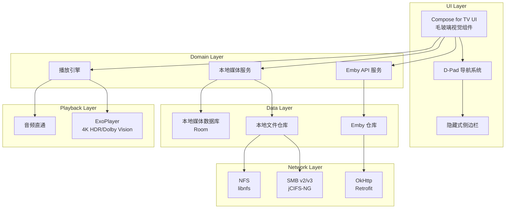

# Emby TV Player - 技术设计方案

需求名称：emby-tv-player  
更新日期：2026-04-06

## 描述

专为 Android TV 平台定制的轻量化影音播放客户端，支持 Emby 远程服务器连接与本地 SMB/NFS 网络存储连接，采用 Jetpack Compose 实现现代主义毛玻璃 UI 风格。

## 架构

## 组件与接口

### 1. Emby API 服务
- **EmbyAuthService**: 用户鉴权（登录/登出）
- **EmbyLibraryService**: 媒体库同步
- **EmbyPlaybackService**: 播放进度回传

### 2. 本地媒体服务
- **SmbMountService**: SMB 挂载与文件浏览
- **NfsMountService**: NFS 挂载与文件浏览
- **LocalScannerService**: 本地文件扫描与元数据匹配

### 3. 播放引擎
- **VideoPlayer**: 视频播放核心（ExoPlayer）
- **AudioTrackSelector**: 音轨选择与直通
- **QualitySelector**: 自动码率协商

## 技术栈

| 层级 | 技术选型 |
|------|----------|
| 语言 | Kotlin |
| UI | Jetpack Compose for TV |
| 播放 | ExoPlayer (Media3) |
| 图片 | Coil |
| 网络存储 | jCIFS-NG (SMB), libnfs (NFS) |
| 本地数据库 | Room |
| DI | Hilt |
| 异步 | Kotlin Coroutines + Flow |

## 开发阶段

| 阶段 | 目标 |
|------|------|
| 第一阶段 | 基础架构搭建：Compose for TV 环境 + D-Pad 导航 |
| 第二阶段 | Emby API 对接：登录、媒体库、流媒体播放 |
| 第三阶段 | 本地协议集成：SMB/NFS 挂载与文件浏览器 |
| 第四阶段 | UI 优化与毛玻璃实现 |
| 第五阶段 | 测试与发布 |
